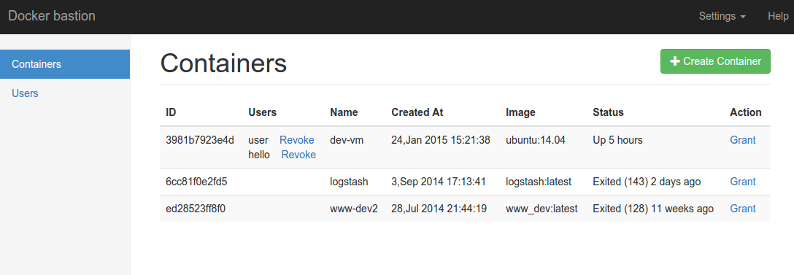
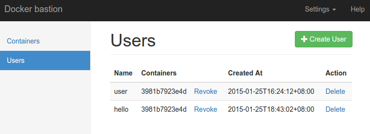

# docker-bastion
Allow users to remote access Docker container via SSH.
You can assign a username and password for each container.  
It can be used as a repleacment of traditional VMs to provide
development environment for developers in your team.

# Features
1. Remote login to running containers via SSH
2. No need to run sshd in container
3. Centralized and flexible user and permission management
4. Web based user and container management

# Install
To use docker bastion you should install docker (>=1.3.0) first.
Check https://docs.docker.com/v1.3/installation/ for docker installation guide.

When docker is ready, run the following commands to build docker-bastion.

```bash
git clone https://github.com/gophergala/docker-bastion.git
cd docker-bastion
./build.sh
```

A pre-built binary is available here [docker-bastion-0.1.0.gz](http://gophergala.github.io/docker-bastion/download/docker-bastion-0.1.0.gz)

# Usage
You can run ```docker-bastion -h``` for help information.

```
NAME:
   docker-bastion - Allow remote accessing docker containers via SSH

USAGE:
   docker-bastion [global options] command [command options] [arguments...]

VERSION:
   0.1.0

AUTHOR:
  Shijiang Wei - <mountkin@gmail.com>

COMMANDS:
   help, h  Shows a list of commands or help for one command
   
GLOBAL OPTIONS:
   --ssh-addr ':2222'   the address that SSH listens
   --manage-addr ':1015'  the address that the management listens
   --help, -h     show help
   --version, -v    print the version

```

When docker-bastion is started, open your browser and visit the
```--manage-addr``` you specified or the default 1015 port of the server.

You can create a user and assign some containers to the user, then the
user can login to the container via
```ssh username.container-id@your-ip -p 2222``` (remeber to change 2222
to your ```--ssh-addr```).

# Screenshot





# Roadmap
1. [ ] replace ```docker exec``` with docker remote API, thus we can manage containers on other hosts.
2. [ ] add tests
